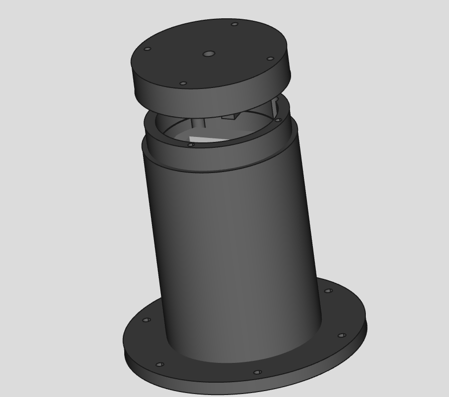

# Allsky Camera Box

It's a FreeCAD based design to enclose a Raspberry HQ allsky camera setup. You can get the fitting cage for the PI [here](https://www.thingiverse.com/thing:6484017).

## References

* [Observatorium Devbar](https://allsky.devbar.de)
* On [Thingiverse](https://www.thingiverse.com/thing:6812192)